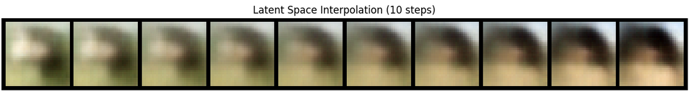
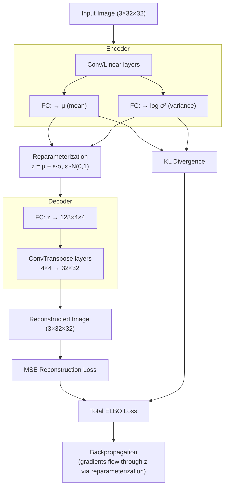
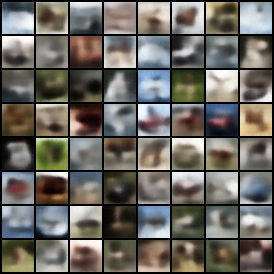
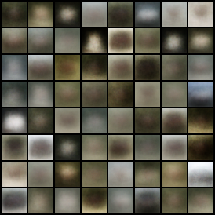
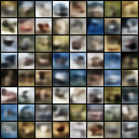
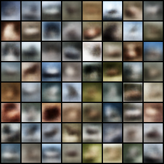
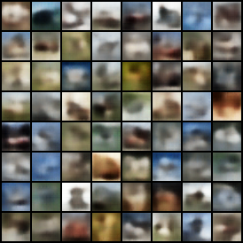
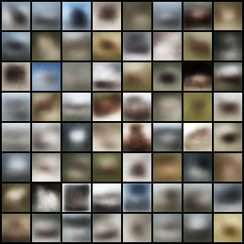

# Variational Autoencoder Architecture Comparison

> Comparative study of Fully Connected and Convolutional VAEs for generative image modeling — trained on CIFAR-10 and CelebA with latent space interpolation analysis.

---

## The "Why"

Standard autoencoders encode images to fixed, discrete points in latent space. These isolated clusters mean sampling between them produces meaningless noise — the model has no concept of the "space between" images.

**Variational Autoencoders** solve this by encoding images as *probability distributions* (mean μ and variance σ²) rather than fixed points. The KL divergence term in the loss function acts as a regularizer that forces the distributions to overlap, creating a smooth, continuous latent space where any sampled point decodes to a meaningful image.

This project explores how much architecture matters: does replacing fully connected layers with convolutional layers (which capture spatial relationships) measurably improve generative quality?

---

## Tech Stack

| Category | Technology | Why Chosen |
|---|---|---|
| **Core ML** | PyTorch | Dynamic computation graphs suited for research; native CUDA support |
| **Datasets** | torchvision CIFAR-10, CelebA | Standard benchmarks with built-in loaders and normalization |
| **Visualization** | Matplotlib, `torchvision.utils.make_grid` | Grid-based image comparison and latent interpolation display |
| **Environment** | Jupyter Notebook | Reproducible research with inline outputs and discussion |
| **Numerics** | NumPy `< 2.0` | Required for torchvision dataset compatibility (pickle format) |

---

## Key Features

### 1. FC-VAE vs. CVAE Architecture Comparison
Two VAE variants were implemented and benchmarked:

- **FC-VAE:** Flattens the 32×32×3 image to a 3072-dim vector, processes through `Linear → ReLU` layers, maps to a `(μ, logvar)` latent space, then mirrors in the decoder. Treats every pixel independently — no spatial awareness.

- **CVAE:** Uses strided convolutions `(3→32→64→128 channels, 32→16→8→4 spatial)` to encode spatial structure before projecting to `(μ, logvar)`. Decoder mirrors with `ConvTranspose2d` layers back to 32×32.

Both use the same **ELBO loss** (Evidence Lower BOund):
```
L = MSE(reconstruction, original) + KL(N(μ,σ²) || N(0,1))
```

### 2. Hyperparameter Sweep with Early Stopping
Three parameter sets were tested to find stable training configurations:

| Set | Batch Size | Learning Rate | Latent Dim | Insight |
|:---:|:---:|:---:|:---:|---|
| p1 | 64 | 1e-3 | 128 | Baseline; LR of 1e-3 showed instability |
| p2 | 128 | 5e-4 | 128 | Larger batch + lower LR → more stable loss |
| p3 | 64 | 5e-4 | 256 | Higher latent dim; best FC-VAE improvement |

Early stopping (`patience=5`, `min_delta=0.5`) prevented overfitting and kept training practical on CPU.

### 3. Latent Space Interpolation
To verify latent space smoothness, two random latent vectors `z1` and `z2` are linearly interpolated:

```
z_interp = (1 - α) · z1 + α · z2,  α ∈ [0, 1]
```

The resulting 10-step transition is decoded to images. A smooth, coherent transition confirms the VAE has learned a well-structured latent space — the KL term is working.



### 4. CelebA Face Generation
The CVAE was retrained on 30% of the CelebA face dataset (~48,831 images) to test generalization beyond CIFAR-10 objects. Images are center-cropped and resized to 32×32. Training converged in ~22 epochs.

---

## Architecture



> **Key insight:** The reparameterization trick routes all randomness through `ε` (a fixed noise input), creating a deterministic, differentiable path from the loss back to the encoder weights.

---

## Results

| Set | Model | Epochs to Stop | Avg Loss | Generated Output |
|:---:|:---:|:---:|:---:|:---:|
| p1 | CVAE | 18 | 74.7 |  |
| p1 | FC-VAE | 40 | 80.7 |  |
| p2 | CVAE | 21 | 74.9 |  |
| p2 | FC-VAE | 33 | 78.2 |  |
| p3 | CVAE | 15 | 75.4 |  |
| p3 | FC-VAE | 23 | 82.6 |  |

**Observations:**
- CVAE consistently achieves lower loss and stops earlier — convolutional inductive bias helps
- FC-VAE converges more slowly and to a higher loss floor across all parameter sets
- Parameter set p2 (lower LR + larger batch) produced the most visually coherent FC-VAE images
- CVAE outputs are remarkably stable in visual quality across all three parameter sets

---

## Challenges & Solutions

### Challenge: Balancing Reconstruction vs. KL Divergence
**Problem:** The naive combination of MSE + KL loss caused the model to prioritize one term over the other depending on scale. Early experiments saw the KL term get "ignored" (posterior collapse), leaving a non-regularized latent space that couldn't generate novel images.

**Solution:** Using `reduction='sum'` in the MSE loss (rather than `'mean'`) keeps both terms on comparable scales relative to the batch. The result is a latent space where the KL term genuinely regularizes — confirmed by smooth latent interpolation producing coherent transitions.

### Challenge: Learning Rate Instability
**Problem:** The default learning rate of `1e-3` caused loss oscillation and premature plateau triggers in parameter set p1.

**Solution:** Reducing to `5e-4` for p2 and p3 stabilized training. The higher batch size in p2 (`128` vs. `64`) provided lower-variance gradient estimates that worked synergistically with the lower LR.

### Challenge: CelebA Scale on CPU
**Problem:** The full CelebA dataset (~162k images) was too large to train on CPU in reasonable time.

**Solution:** Random 30% subset (~48k images) was sampled using `np.random.choice` + `torch.utils.data.Subset`. The model still learned meaningful face structure, though with expected blurriness at this resolution and scale.

---

## Setup & Usage

### Prerequisites
```bash
pip install torch torchvision "numpy<2.0" matplotlib jupyter
```
> **Note:** NumPy must be `< 2.0` due to a pickle format compatibility issue with torchvision dataset loaders.

### Run the Notebook
```bash
jupyter notebook Assignment3-VariationAutoencoders.ipynb
```

### Generate New Images
After training, load any saved model checkpoint and run **Task 1.5** cells. Change the `params` variable to switch between parameter sets (p1, p2, p3).

### Dataset Setup
- **CIFAR-10:** Downloaded automatically via `torchvision.datasets.CIFAR10(download=True)`
- **CelebA:** Requires manual download to `./data/celeba/` due to Google Drive rate limits. See [torchvision CelebA docs](https://pytorch.org/vision/stable/generated/torchvision.datasets.CelebA.html).

---

*Generative AI Disclaimer: Some code in this project was generated with AI assistance. All outputs were reviewed before inclusion.*
